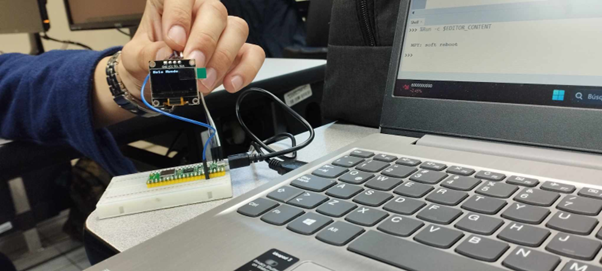

# Practica 2.1.1

# Depto de Sistemas y Computación
# Ing. En Sistemas Computacionales

# SISTEMAS PROGRAMABLES 23a

# OBJETIVO:

Practica De inicio es la básico de desplegar algo en pantalla en el OLED Display.

# CÓDIGO

    import machine
    import ssd1306
    #Configura la comunicación I2C para el display OLED
    i2c = machine.I2C(0, scl=machine.Pin(8), sda=machine.Pin(9))
    oled = ssd1306.SSD1306_I2C(128, 64, i2c)
    #Limpia la pantalla OLED
    oled.fill(0)
    oled.show()
    #Muestra "Hola mundo" en la pantalla OLED
    oled.text("Hola mundo", 0, 0)
    oled.show()

# PRUEBAS

# CONCLUSIONES

Dentro de esta practica se aprendio lo basico del uso de un raspberryb pi pico w con un display OLED.
