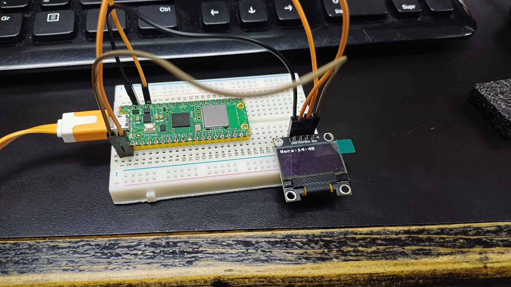

# Depto de Sistemas y Computación
# Ing. En Sistemas Computacionales

# SISTEMAS PROGRAMABLES 23a

# OBJETIVO:

Practica De inicio es la básico de desplegar algo en pantalla en el OLED Display.

# CÓDIGO

    # Imports
    import time
    import utime
    import network  # for Wifi
    from machine import Pin, I2C  # for LED
    import ntptime
    import ssd1306
    
    # Global to check if time is set
    global time_is_set
    global wifi_is_connected
    
    ssid = 'TecNM-ITT-Docentes'
    password = 'tecnm2022!'
    
    def wifi_connect(ssid, password):
        global wifi_is_connected  # Declare wifi_is_connected as a global variable
        # Connect to WiFi
        wlan = network.WLAN(network.STA_IF)
        wlan.active(True)
        wlan.connect(ssid, password)
    
        max_wait = 15
        while max_wait > 0:
            if wlan.status() < 0 or wlan.status() >= 3:
                break
            max_wait -= 1
            time.sleep(5)
    
        if wlan.status() != 3:
            raise RuntimeError('Network connection failed')
        else:
            wifi_is_connected = True
            status = wlan.ifconfig()
    
    def ReturnNTPTimeServer():
        # Sincronizar la hora con un servidor NTP
        ntptime.settime()
        # Get the current time as a tuple
        time_zone_offset = -7 * 3600  # 7 hours behind UTC in seconds
        # Synchronize the time with an NTP server
        current_time = utime.localtime(utime.mktime(utime.localtime()) + time_zone_offset)
        # Individual Components of the time
        year = current_time[0]
        month = current_time[1]
        day = current_time[2]
        hour = current_time[3]
        minute = current_time[4]
        second = current_time[5]
        day_of_week = current_time[6]
        day_of_year = current_time[7]
        Formated = "{}:{}".format(hour, minute)
        i2c = I2C(0, sda=Pin(0), scl=Pin(1))
        display = ssd1306.SSD1306_I2C(128, 64, i2c)
        if 0 <= hour <= 12:
            display.fill(0)
            display.text("Hora:" + Formated, 0, 0)
            display.show()
        elif 12 < hour <= 18:
            display.fill(0)
            display.text("Hora:" + Formated, 0, 0)
            display.show()
        else:
            display.fill(0)
            display.text("Hora:" + Formated, 0, 0)
            display.show()
    
    while True:
        wifi_connect(ssid, password)
        ReturnNTPTimeServer()
        time.sleep(60)
        led.off()
        time.sleep(0.1)

# PRUEBAS

# CONCLUSIONES

Dentro de esta practica se aprendio lo basico del uso de un raspberryb pi pico w con un display OLED.
