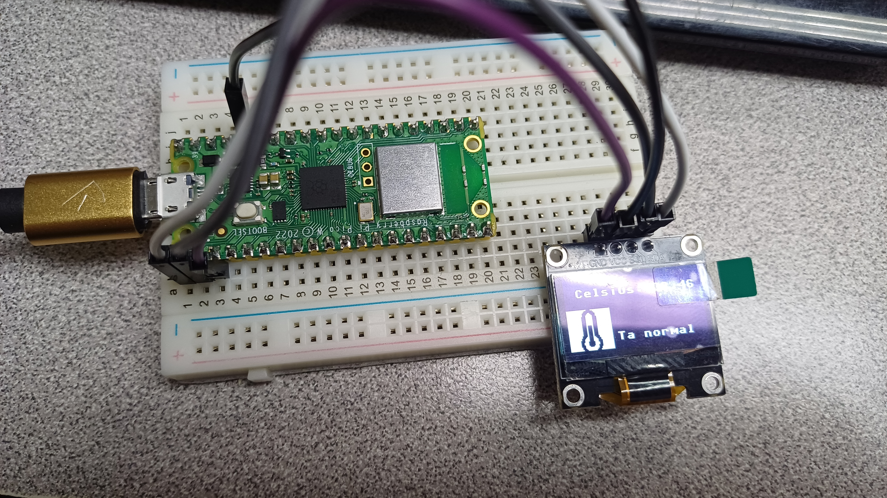

# Depto de Sistemas y Computación
# Ing. En Sistemas Computacionales

# SISTEMAS PROGRAMABLES 23a

# OBJETIVO:

Hacer uso de el sensor interno de temperatura de la Pico W
Desplegar la  temperatura e incluir un bitArray imagen tematica de esta pràctica (Frio, Càlido, Caliente).

# CÓDIGO

    # Montes Ojeda Luis Antonio - 20211814
    
    import machine
    import framebuf
    import time
    import ssd1306
    
    
    # Configuración del OLED
    i2c = machine.I2C(0, sda=machine.Pin(0), scl=machine.Pin(1), freq=400000)
    oled = ssd1306.SSD1306_I2C(128, 64, i2c)
    
    # Imagenes en bytearrays
    icon_fire = bytearray([
    0xff, 0xff, 0xff, 0xff, 0x1f, 0x1f, 0x1f, 0x3f, 0x7f, 0xff, 0x00, 0x00, 0x01, 0x03, 0x0f, 0x1f,
    0x3f, 0x7f, 0x07, 0x03, 0xf1, 0xf8, 0xf8, 0xf8, 0xf8, 0xf8, 0xf1, 0xc1, 0x03, 0x0f, 0xff, 0xff,
    0xff, 0xff, 0xff, 0xff, 0xff, 0xff, 0xff, 0xff, 0xff, 0xff, 0xff, 0x0f, 0x00, 0x00, 0x80, 0xe0,
    0x80, 0x00, 0x00, 0xc0, 0xf0, 0xfc, 0xf8, 0xc0, 0x00, 0x00, 0x00, 0x00, 0xff, 0xff, 0xff, 0x00,
    0x00, 0xff, 0xff, 0xff, 0x00, 0x00, 0xff, 0xff, 0xff, 0xff, 0xff, 0xff, 0xff, 0xff, 0xff, 0xff,
    0xff, 0xff, 0xff, 0xf0, 0xc0, 0x80, 0x0f, 0x1f, 0x3f, 0x3e, 0x3e, 0x3f, 0x3f, 0x3f, 0x1f, 0x0f,
    0x82, 0x80, 0x00, 0x00, 0xff, 0xff, 0xff, 0x00, 0x00, 0xff, 0xff, 0xff, 0x00, 0x00, 0xff, 0xff,
    0xff, 0xff, 0xff, 0xff, 0xff, 0xff, 0xff, 0xff, 0xff, 0xff, 0xff, 0xff, 0xff, 0xff, 0xff, 0xff,
    0xfe, 0xfe, 0xfe, 0xfe, 0xfe, 0xfe, 0xff, 0x0f, 0x03, 0x01, 0xf0, 0xf8, 0xff, 0x1f, 0x0f, 0x00,
    0x00, 0x1f, 0x3f, 0xff, 0xf8, 0xe0, 0x03, 0x07, 0x7f, 0xff, 0xff, 0xff, 0xff, 0xff, 0xff, 0xff,
    0xff, 0xff, 0xff, 0xff, 0xff, 0xff, 0xff, 0xff, 0xff, 0xff, 0xff, 0xff, 0xff, 0xff, 0xff, 0xfc,
    0xf0, 0xe0, 0xc7, 0x8f, 0x9f, 0x1c, 0x1c, 0x1c, 0x1c, 0x1c, 0x9e, 0x8f, 0xc7, 0xc1, 0xe0, 0xf8,
    0xff, 0xff, 0xff, 0xff, 0xff, 0xff, 0xff, 0xff])
    
    icon_ice = bytearray([
    0xff, 0xff, 0xff, 0xff, 0xff, 0xff, 0xff, 0xff, 0xff, 0xfb, 0xfd, 0x0f, 0xf6, 0xf6, 0xff, 0xfd,
    0x03, 0xff, 0x3f, 0xef, 0xf7, 0xfb, 0x6d, 0x1f, 0x1e, 0x6e, 0x82, 0x0e, 0x8f, 0x0f, 0x6d, 0x7b,
    0xf7, 0xcf, 0xff, 0xff, 0xff, 0xff, 0xff, 0xff, 0xff, 0xff, 0xff, 0xff, 0xff, 0xff, 0xff, 0xff,
    0xff, 0xff, 0xff, 0x00, 0xff, 0xff, 0xff, 0xff, 0x00, 0xff, 0xfc, 0xf7, 0xde, 0xbe, 0xe0, 0x70,
    0xf0, 0xe4, 0xc1, 0xf0, 0x70, 0x70, 0xa6, 0xfe, 0xef, 0xf3, 0xff, 0xff, 0xff, 0xff, 0xff, 0xff,
    0xff, 0xff, 0xff, 0xff, 0xff, 0xff, 0xff, 0xff, 0xff, 0xff, 0xff, 0x60, 0x3f, 0x3f, 0xff, 0xff,
    0x00, 0xff, 0xff, 0xff, 0xff, 0xff, 0xff, 0xff, 0xff, 0xff, 0xff, 0xff, 0xff, 0xff, 0xff, 0xff,
    0xff, 0xff, 0xff, 0xff, 0xff, 0xff, 0xff, 0xff, 0xff, 0xff, 0xff, 0xff, 0xff, 0xff, 0x9f, 0xef,
    0x77, 0x1f, 0x1f, 0x00, 0x00, 0x00, 0x0f, 0x1f, 0x38, 0xf7, 0xef, 0x3f, 0xff, 0xff, 0xff, 0xff,
    0xff, 0xff, 0xff, 0xff, 0xff, 0xff, 0xff, 0xff, 0xff, 0xff, 0xff, 0xff, 0xff, 0xff, 0xff, 0xff,
    0xff, 0xff, 0xff, 0xff, 0xff, 0xff, 0xf3, 0xef, 0xdc, 0xb0, 0xe0, 0x60, 0x60, 0x60, 0x60, 0xe0,
    0xb0, 0xdc, 0xef, 0xf8, 0xff, 0xff, 0xff, 0xff, 0xff, 0xff, 0xff, 0xff, 0xff, 0xff, 0xff, 0xff,
    0xff, 0xff, 0xff, 0xff, 0xff, 0xff, 0xff, 0xff])
    
    icon_cloud = bytearray([
    0xff, 0xff, 0xff, 0xff, 0xff, 0xff, 0xff, 0xff, 0xff, 0xff, 0xff, 0xff, 0xff, 0x3f, 0x07, 0x03,
    0x01, 0xe1, 0xf0, 0xf8, 0xf8, 0xf0, 0xe1, 0x01, 0x03, 0x07, 0x3f, 0xff, 0xff, 0xff, 0xff, 0xff,
    0xff, 0xff, 0xff, 0xff, 0xff, 0xff, 0xff, 0xff, 0xff, 0xff, 0xff, 0xff, 0xff, 0xff, 0xff, 0xff,
    0xff, 0xff, 0xff, 0xff, 0xff, 0x00, 0x00, 0x00, 0x00, 0xff, 0x3f, 0x3f, 0x3f, 0x3f, 0xff, 0x00,
    0x00, 0x00, 0x00, 0xff, 0xff, 0xff, 0xff, 0xff, 0xff, 0xff, 0xff, 0xff, 0xff, 0xff, 0xff, 0xff,
    0xff, 0xff, 0xff, 0xff, 0xff, 0xff, 0xff, 0xff, 0xff, 0xff, 0xff, 0xff, 0x7f, 0x00, 0x00, 0x00,
    0x00, 0xff, 0x00, 0x00, 0x00, 0x00, 0xff, 0x00, 0x00, 0x00, 0x00, 0x7f, 0xff, 0xff, 0xff, 0xff,
    0xff, 0xff, 0xff, 0xff, 0xff, 0xff, 0xff, 0xff, 0xff, 0xff, 0xff, 0xff, 0xff, 0xff, 0xff, 0xff,
    0xff, 0xff, 0x07, 0x01, 0x00, 0x60, 0xfc, 0xfe, 0xff, 0x0f, 0x00, 0x00, 0x00, 0x00, 0x0f, 0xff,
    0xfe, 0xfc, 0x60, 0x00, 0x01, 0x07, 0xff, 0xff, 0xff, 0xff, 0xff, 0xff, 0xff, 0xff, 0xff, 0xff,
    0xff, 0xff, 0xff, 0xff, 0xff, 0xff, 0xff, 0xff, 0xff, 0xff, 0xfe, 0xf8, 0xe0, 0xc0, 0xc3, 0x87,
    0x8f, 0x0f, 0x1e, 0x1e, 0x1e, 0x1e, 0x0f, 0x8f, 0x87, 0xc3, 0xc0, 0xe0, 0xf8, 0xfe, 0xff, 0xff,
    0xff, 0xff, 0xff, 0xff, 0xff, 0xff, 0xff, 0xff])
    
    # Objetos framebuf para las imagenes
    icon_buffer_fire = framebuf.FrameBuffer1(memoryview(icon_fire), 40, 40)
    icon_buffer_ice = framebuf.FrameBuffer1(memoryview(icon_ice), 40, 40)
    icon_buffer_cloud = framebuf.FrameBuffer1(memoryview(icon_cloud), 40, 40)
    
    # Función para mostrar la imagen  y la temperatura
    def display_icon_and_temperature(icon, temperature):
        oled.fill(0)  # Limpiar la pantalla
    
        # Mostrar ícono
        oled.blit(icon, 0, 28)  # Ajusta la posición
    
        # Convertir el valor a cadena
        temp_c_str = "{:.2f}".format(temperature)
    
        # Mostrar temperatura en el OLED
        oled.text("Celsius: {}".format(temp_c_str), 10, 10, 1)
    
        # Mostrar leyenda al lado de la imagen 
        if icon == icon_buffer_fire:
            oled.text("Hot temp", 44, 50, 1)  # Ajusta la posición
        elif icon == icon_buffer_ice:
            oled.text("Cold temp", 44, 50, 1)
        elif icon == icon_buffer_cloud:
            oled.text("Nice temp", 44, 50, 1)
    
        oled.show()  # Actualizar la pantalla
    
    # Configuración del sensor de temperatura
    adc = machine.ADC(4)  # Puerto analógico A4
    
    while True:
        ADC_voltage = adc.read_u16() * (3.3 / 65536)
        temperature_celsius = 27 - (ADC_voltage - 0.706) / 0.001721
    
        # Determinar qué imagen mostrar según la temperatura
        if temperature_celsius < 15:
            display_icon_and_temperature(icon_buffer_ice, temperature_celsius)
        elif 15 <= temperature_celsius < 25:
            display_icon_and_temperature(icon_buffer_cloud, temperature_celsius)
        else:
            display_icon_and_temperature(icon_buffer_fire, temperature_celsius)
    
        # Imprimir temperatura en la consola en grados celsius
        print("Celsius: {:.2f}".format(temperature_celsius))
    
        # Tiempo de espera para tomar la siguiente temperatura
        time.sleep_ms(500)

# PRUEBAS

# CONCLUSIONES

Dentro de esta practica se aprendio a utilizar el sensor de temperatura del raspberryb pi pico w y realizar una conversion de imagenes a bitarryas para desplegar ambos dentro de un display OLED.
