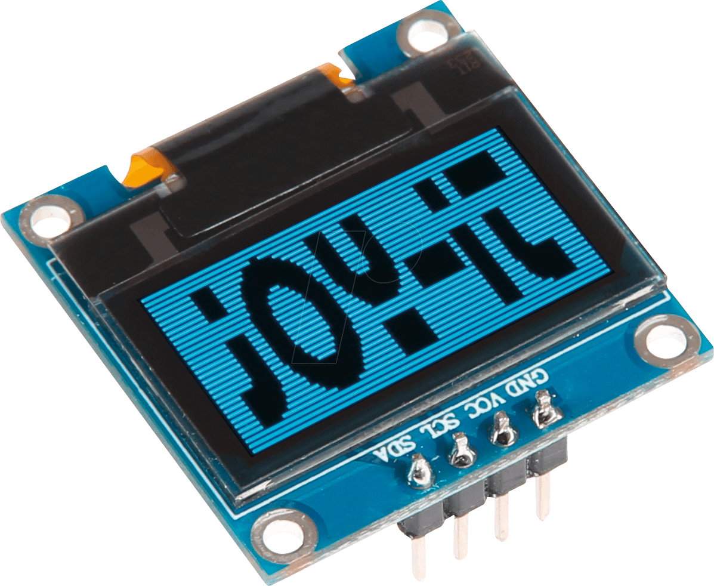

# BOARD-SSD1306
# Luis Antonio Montes Ojeda - 20211814

## ¿Qué es BOARD-SSD1306?

BOARD-SSD1306 es una placa o tarjeta electrónica que utiliza el controlador SSD1306 para gestionar pantallas OLED. Las pantallas OLED (Diodos Orgánicos Emisores de Luz) son una tecnología de visualización que ofrece colores brillantes y alta resolución. BOARD-SSD1306 actúa como un puente entre un microcontrolador o una computadora y la pantalla OLED, permitiendo mostrar texto, gráficos y otros elementos visuales en la pantalla.

## Componentes Principales

Los componentes principales de BOARD-SSD1306 incluyen:

- **Controlador SSD1306**: El corazón de la placa, que controla la pantalla OLED y gestiona la comunicación con otros dispositivos.
- **Conexiones y Puertos**: Conectores para conectar BOARD-SSD1306 a una pantalla OLED y a otros dispositivos, como microcontroladores o Raspberry Pi.
- **Interfaz de Comunicación**: Puede utilizar interfaces como I2C (Inter-Integrated Circuit) o SPI (Serial Peripheral Interface) para comunicarse con otros dispositivos.
- **Fuente de Alimentación**: Proporciona la energía necesaria para el funcionamiento de la placa y la pantalla.

Los pines que presenta son:

| Pin                | Descripción                                        |
|--------------------|----------------------------------------------------|
| SCL                | Serial Clock para la comunicación I2C             |
| SDA                | Serial Data para la comunicación I2C o pin de datos en SPI |
| VCC                | Voltaje positivo (3.3V o 5V) para la alimentación  |
| GND                | Conexión a tierra                                  |

## Funcionamiento de BOARD-SSD1306

BOARD-SSD1306 funciona enviando comandos y datos a la pantalla OLED a través del controlador SSD1306. Los comandos pueden incluir instrucciones para limpiar la pantalla, establecer el brillo, posicionar el cursor y más. Los datos se utilizan para mostrar texto y gráficos en la pantalla.

La comunicación con BOARD-SSD1306 generalmente se realiza a través de un protocolo como I2C o SPI. Los microcontroladores y computadoras pueden enviar comandos y datos a BOARD-SSD1306, que a su vez los traduce en acciones visuales en la pantalla OLED.

## Aplicaciones y Usos

BOARD-SSD1306 se utiliza en una variedad de aplicaciones, incluyendo:

- **Pantallas de Información**: Para mostrar datos en tiempo real, como información meteorológica, relojes, o estadísticas.
- **Dispositivos Portátiles**: En dispositivos como relojes inteligentes y gafas de realidad virtual.
- **Proyectos DIY**: En proyectos de electrónica y robótica para mostrar información relevante.
- **Instrumentación y Medición**: En paneles de control y dispositivos de medición.

## Ventajas de BOARD-SSD1306

Algunas de las ventajas de utilizar BOARD-SSD1306 incluyen:

- **Calidad de Pantalla**: Las pantallas OLED ofrecen colores nítidos y negros profundos.
- **Bajo Consumo de Energía**: Consumen menos energía que las pantallas LCD tradicionales.
- **Facilidad de Uso**: BOARD-SSD1306 simplifica la interfaz con las pantallas OLED, lo que facilita la programación.
- **Tamaño Compacto**: Son ideales para dispositivos compactos y portátiles debido a su delgadez y tamaño reducido.

## Ejemplo

(https://wokwi.com/projects/359558101922696193)
